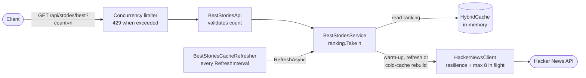

# Hacker News Best Stories API

ASP.NET Core (.NET 10) RESTful API that returns the details of the best `n` stories from the
[Hacker News API](https://github.com/HackerNews/API), ordered by score (descending).

## Requirements

- [.NET SDK 10.0](https://dotnet.microsoft.com/download/dotnet/10.0) (see `global.json`)
- [Docker](https://www.docker.com/) (optional)

## How to run

### With the .NET CLI

```bash
dotnet run --project src/HackerNews.BestStories.Api
```

### With Docker

```bash
docker build -t hackernews-beststories .
docker run --rm -p 8080:8080 hackernews-beststories
```

The OpenAPI document is available at `/openapi/v1.json`.

### Configuration

Settings live in `appsettings.json` and can be overridden with environment variables (e.g.
`HackerNews__RefreshInterval=00:00:30`). Invalid values stop the application on start.

| Setting | Default | Description |
|---|---|---|
| `HackerNews:BaseAddress` | `https://hacker-news.firebaseio.com/v0/` | Hacker News API base address (absolute) |
| `HackerNews:RefreshInterval` | `00:01:00` | How often the cache is refreshed in the background (1 s – 1 day) |
| `HackerNews:CacheExpiration` | `00:03:00` | Lifetime of the cached entries; must be greater than `RefreshInterval` |
| `HackerNews:MaxConcurrentRequests` | `8` | Maximum calls in flight to Hacker News (1 – 64), retries included |
| `RequestConcurrency:PermitLimit` | `1000` | Maximum incoming requests processed at once (1 – 100000) |
| `RequestConcurrency:QueueLimit` | `0` | Incoming requests queued when the permits are exhausted (0 – 100000) |

### Usage

```bash
curl "http://localhost:8080/api/stories/best?count=3"
```

Returns the best `count` stories ordered by score descending:

```json
[
  {
    "title": "A uBlock Origin update was rejected from the Chrome Web Store",
    "uri": "https://github.com/uBlockOrigin/uBlock-issues/issues/745",
    "postedBy": "ismaildonmez",
    "time": "2019-10-12T13:43:01+00:00",
    "score": 1716,
    "commentCount": 572
  }
]
```

| Status | When |
|---|---|
| `200 OK` | Stories returned. There is no upper limit: a `count` above the best stories provided by Hacker News (currently at most 200) returns all of them |
| `400 Bad Request` | Validation `ProblemDetails` with the error in `errors.count`: *"The count query parameter is required."* when it is missing or empty, *"count must be an integer greater than or equal to 1."* otherwise |
| `429 Too Many Requests` | The global limit of concurrent requests (`RequestConcurrency:PermitLimit`, default 1000) is exceeded (`ProblemDetails`) |
| `503 Service Unavailable` | Hacker News is unavailable and there is no cached data yet (`ProblemDetails`) |

### Health checks

| Endpoint | Healthy (`200`) when |
|---|---|
| `/health/live` | The process responds (no dependency is checked) |
| `/health/ready` | The best stories ranking is cached, so requests are served without calling Hacker News |

Unhealthy checks return `503`. Both endpoints only read local state (never Hacker News) and are
excluded from the concurrency limiter, so they keep answering under load.

## How to test

```bash
dotnet test
```

The full local quality gate (the same checks as CI) runs automatically before every `git push`
and can be run manually:

```bash
.githooks/pre-push
```

The hook is versioned in `.githooks/` and enabled automatically by the first local build
(`git config core.hooksPath .githooks`, see `Directory.Build.props`).

Test conventions:

- **Unit tests** exercise one type in isolation (collaborators replaced with NSubstitute or
  hand-written fakes, time with `FakeTimeProvider`).
- **Component tests** run the whole API in-process with `WebApplicationFactory`, with Hacker News
  stubbed by WireMock.Net. No test calls the real Hacker News API.
- Test folders and namespaces **mirror the source**: `src/.../Services/Foo.cs` →
  `tests/...UnitTests/Services/FooTests.cs` (namespace `HackerNews.BestStories.Api.UnitTests.Services`),
  one `{Type}Tests` class per type.
- Shared hand-written fakes and stubs live in `TestDoubles/` at the root of each test project, the
  only test folder that does not mirror the source.
- Test names follow `Method_Scenario_ExpectedResult`.
- Coverage is merged and checked against the threshold (80% lines) by `build/coverage.sh`.

## Project structure

```
src/HackerNews.BestStories.Api/
├── Apis/                    Minimal API endpoint groups
├── BackgroundServices/      Hosted services (periodic cache refresh)
├── Extensions/              Service registration and pipeline extension methods
├── HealthChecks/            Health checks (readiness: ranking cached)
├── Infrastructure/
│   └── HackerNews/          Typed HttpClient, upstream DTOs and options
├── Models/                  Public API contracts
├── RateLimiting/            Options of the global incoming concurrency limiter
├── Services/                Application logic
└── Program.cs
tests/
├── HackerNews.BestStories.Api.UnitTests/       Unit tests (mirror the src folders)
├── HackerNews.BestStories.Api.ComponentTests/  In-process API tests, Hacker News stubbed (mirror the src folders)
└── HackerNews.BestStories.Api.LoadTests/       k6 script, WireMock stub mappings and compose file (SLO)
build/coverage.sh            Merges coverage and enforces the threshold
.githooks/pre-push           Local quality gate
.github/                     CI, CodeQL and load test workflows, path filters, ruleset, Dependabot
docs/implementation-plan.md  Agreed design decisions and implementation steps
```

The layout follows Microsoft's reference Minimal API services (eShop): endpoints grouped with
route-group extension methods (e.g. `BestStoriesApi.MapBestStoriesApi`), dependency injection wired
through extension methods, and technical folders inside a single web project.

### Development conventions

- Development follows **TDD**: a failing test first, the minimum code to pass it, then refactor.
- Code follows the Microsoft .NET naming and coding conventions. `.editorconfig` is enforced on
  build and warnings are errors (`Directory.Build.props`).
- Package versions live only in `Directory.Packages.props` (Central Package Management): a
  `PackageReference` never has a `Version`. Restores are locked, so updated `packages.lock.json`
  files are committed.
- `main` is protected: every change goes through a pull request (see [Quality gates](#quality-gates)).

## Design



- **Requests never call Hacker News in steady state.** Each request reads a single cache entry, the
  ranking of all best stories sorted by score, and returns its first `n` items. The cost of a
  request is independent of the Hacker News latency and the served load does not reach Hacker News.
- **Hybrid caching with `HybridCache`** (in-memory). Three kinds of entries: the best story IDs
  (`hackernews:beststories`), each mapped story (`hackernews:item:{id}`) and the ranking
  (`beststories:ranked`). The cached types are immutable, so `HybridCache` hands out the cached
  instance instead of a copy per request.
- **Background refresh.** `BestStoriesCacheRefresher` warms up the ranking on start and then, every
  `RefreshInterval` (60 s), re-fetches the IDs and the items and overwrites the entries. Hacker News
  receives at most 1 + 200 calls per interval, whatever the incoming load.
- **Graceful degradation.** Entries live for `CacheExpiration` (3 min), longer than the refresh
  interval, and a refresh only overwrites them on success: while Hacker News is down the last good
  ranking keeps being served. An item that fails during a refresh keeps its cached copy; one that
  fails during a rebuild is skipped. Only when there is no cached ranking and Hacker News is down
  does the API answer `503`.
- **Cold cache.** Requests that find no ranking rebuild it with `GetOrCreateAsync`; its stampede
  protection runs a single rebuild for all concurrent requests, fetching only the items that are not
  cached yet.
- **Ranking.** All the best stories (up to 200) are ranked by `score`, because Hacker News does not
  guarantee the `beststories` order is by score. The sort is stable, so ties keep the Hacker News
  order. `null`, deleted, dead and non-story items are excluded.
- **Resilient, bounded outgoing calls.** The typed `HttpClient` uses `AddStandardResilienceHandler()`
  (retries with backoff, circuit breaker, attempt and total timeouts). Its concurrency limiter, the
  outermost strategy, is shared by every client instance and bounds the calls in flight to
  `MaxConcurrentRequests` (8), retries included, which also avoids the TLS errors observed with
  many parallel connections.
- **Inbound protection.** A global concurrency limiter rejects requests beyond
  `RequestConcurrency:PermitLimit` with `429`, so an overload degrades into fast rejections instead
  of unbounded latency. Health endpoints are excluded.
- **Operability.** `/health/ready` only reports ready once the ranking is cached, so a load balancer
  does not route traffic to an instance that would still have to call Hacker News. Every error is
  an RFC 9457 `ProblemDetails`.

## Service Level Objectives (SLO)

Measured for `GET /api/stories/best?count={n}` with a mix of `n` (30% of requests with `n = 200`,
the worst case) on the reference environment: a GitHub-hosted `ubuntu-latest` runner (4 vCPU shared
by the API, the stub and k6) with the API running in its Docker image and Hacker News replaced by a
stub that adds 100 ms latency per call.

| Objective | Target |
|---|---|
| Sustained load | **1000 requests/second** |
| Latency at that load | **p95 < 50 ms**, **p99 < 100 ms** |
| Error rate at that load | **< 0.1%** |
| Hacker News protection | At most one full refresh (1 + 200 requests) per refresh interval, **independent of the incoming load** |
| Data freshness | Stories are at most one refresh interval old (default 60 s) while Hacker News is available |

They are enforced as k6 thresholds in
[`best-stories.js`](tests/HackerNews.BestStories.Api.LoadTests/scripts/best-stories.js).

#### Calibration

The targets were calibrated with 3-minute runs of the `Load test` workflow on the reference
environment:

| Rate | p95 | p99 | Errors | Dropped iterations | Hacker News calls |
|---|---|---|---|---|---|
| 500 req/s | 0.3 ms | 0.6 ms | 0% | 0 | 603 |
| 1000 req/s | 0.7 ms | 2.2 ms | 0% | 0 | 603 |
| 2000 req/s | 10.2 ms | 30.6 ms | 0% | 344 | 603 |
| 4000 req/s | 339 ms | 485 ms | 0% | 235 372 (peak ~2700 req/s) | 603 |

The runner saturates at about 2000–2700 req/s (CPU shared with the load generator; the per-request cost is most
likely serializing up to 200 stories per response). The sustained load objective is set at half of
that, and the latency targets leave room for the variance of shared runners. Hacker News
received exactly one full refresh (201 calls) per minute in every run, independently of the load.

### Load test

The [`Load test`](.github/workflows/load-test.yml) workflow runs **on demand** (Actions → *Load
test* → *Run workflow*, with configurable rate and duration). It starts the API and a WireMock stub
of Hacker News with Docker Compose, drives a constant arrival rate with [k6](https://k6.io/), and
fails when any SLO threshold is breached. The SLO report is written to the workflow run summary, and
the raw results (JSON and HTML report) are uploaded as an artifact.

In a product maintained by a team, the workflow would run **nightly** (the schedule is already in
the workflow, commented out) to track how the SLO evolves as the team introduces changes and
improvements. It is disabled here because this coding test is a one-off deliverable without
continuous improvement, so scheduled runs would only repeat the same measurement.

Run it locally:

```bash
docker compose -f tests/HackerNews.BestStories.Api.LoadTests/compose.yaml up -d --build api hackernews-stub
docker compose -f tests/HackerNews.BestStories.Api.LoadTests/compose.yaml run --rm k6
docker compose -f tests/HackerNews.BestStories.Api.LoadTests/compose.yaml down
```

`RATE`, `DURATION` and `REFRESH_INTERVAL` can be overridden as environment variables. Results are
written to `tests/HackerNews.BestStories.Api.LoadTests/results/`.

## Assumptions

- The Hacker News `beststories` endpoint returns at most **200** IDs, so `n` greater than 200
  returns all available stories (the API sets no upper limit, following the usual practice for
  result-size parameters); `n` lower than 1 is rejected with `400 Bad Request`.
- The best stories are ranked by `score` across the whole `beststories` list, not only the first
  `n` IDs, because Hacker News does not guarantee that list is ordered by score.
- Data may be slightly stale (up to the configured refresh interval); this is the trade-off that
  keeps the Hacker News load independent of the incoming traffic.
- A story without `url` (e.g. *Ask HN*) uses its Hacker News page as `uri`
  (`https://news.ycombinator.com/item?id={id}`), and a missing `descendants` is `commentCount = 0`.
- Items that are `null`, deleted, dead or not of type `story` are not returned, so fewer than `n`
  stories may be returned even when `n` ≤ 200.
- `time` is returned in UTC (`+00:00`).
- Stories with the same score keep the Hacker News `beststories` order.
- Each instance keeps its own in-memory cache: with `k` instances Hacker News receives `k` refreshes
  per interval, which is acceptable for a small number of instances.
- The API is public and read-only: no authentication is required.

## Enhancements given more time

- **Distributed L2 cache** (e.g. Redis through `HybridCache`) and a single refresher (leader
  election or a separate worker), so that scaling out does not multiply the Hacker News load.
- **Incremental refresh** with `/v0/updates.json`, fetching only the items that changed instead of
  all 200 every interval.
- **HTTP caching**: `Cache-Control`/`ETag` headers or ASP.NET Core output caching, so clients and
  CDNs can serve repeated requests; precomputing the serialized ranking would also cut the per-request
  CPU cost, which is the throughput bottleneck.
- **Per-client rate limiting** (partitioned by API key or IP) on top of the global concurrency limit.
- **Observability**: OpenTelemetry traces and metrics (cache hit ratio, refresh duration and
  failures, Hacker News calls), exported to a monitoring backend with alerts on the SLO.
- **Configurable readiness grace**: stay ready for a while after the ranking expires if Hacker News
  is down, serving stale data for longer (`stale-while-revalidate`-style).
- **API versioning** and a `Retry-After` header on `429`/`503`.
- **Load test** on dedicated infrastructure (separate load generator) and longer soak tests.

## Quality gates

| Gate | Local (`pre-push`) | CI |
|---|---|---|
| Formatting (`dotnet format --verify-no-changes`) | ✅ | ✅ |
| Build with analyzers, warnings as errors | ✅ | ✅ |
| Unit and component tests | ✅ | ✅ |
| Line coverage ≥ 80% | ✅ | ✅ |
| Locked NuGet restore and vulnerable package audit | | ✅ |
| Docker image build and Trivy scan | | ✅ |
| CodeQL static analysis | | ✅ |
| SLO load test | | ✅ (on demand) |

`main` is protected by a repository ruleset ([definition](.github/rulesets/main.json)): changes go
through pull requests, the `Build & test`, `Docker image` and `Analyze C#` checks must pass and the
branch must be up to date. Force pushes and deletion are blocked.

CI and CodeQL jobs only run when files that affect them change (see
[`.github/path-filters.yml`](.github/path-filters.yml)); documentation-only changes skip them while
the required checks still report as passed.
